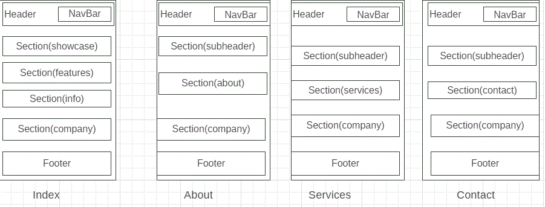

# Development Strategy

> `app-theme`

write a short description of your project:
- who would want to use it?
- why would they want to use it?

## Wireframe

<!-- include a wireframe for your project in this repository, and display it here -->
<!-- wireframe.cc is a good site for getting started with wireframes -->

## 0. Set-Up

__A User can see my initial repository and live demo__

### Repo

- Generate from Template
- Write initial, basic README
- Turn on GitHub Pages

## 1. Header and navigation bar

__full user story description__

### Repo

1. This user story was developed locally on a branch called `1-header-navbar`
1. The new branch was pushed to the repository
1. A pull request was made for review
1. Changes were merged to `master`

### HTML

- A header element with a title describing the web page
- A navbar containing information such as home, about services and contact
- layout style

### CSS

- Text styling for the main title
- styling of the navigation bar

## 2. Showcase

__full user story description__

### Repo

1. This user story was developed locally on a branch called `2-showcase`
1. The new branch was pushed to the repository
1. A pull request was made for review
1. Changes were merged to `master`

### HTML

- Adding welcome
- Adding some text 

### CSS

- adding image background
- styling h1 and p

## 3. Features

__full user story description__

### Repo

1. This user story was developed locally on a branch called `3-features`
1. The new branch was pushed to the repository
1. A pull request was made for review
1. Changes were merged to `master`

### HTML

- adding font awesome
- Information about each font

### CSS

- styling h1 p and font

## Finishing Touches

- Write final, complete README:
  - [makeareadme.com](https://www.makeareadme.com/)
  - [bulldogjob](https://bulldogjob.com/news/449-how-to-write-a-good-readme-for-your-github-project)
  - [meakaakka](https://medium.com/@meakaakka/a-beginners-guide-to-writing-a-kickass-readme-7ac01da88ab3)
- Validate code to check for any last mistakes
